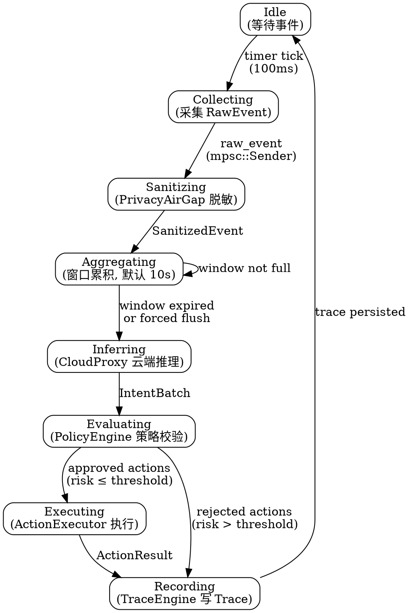
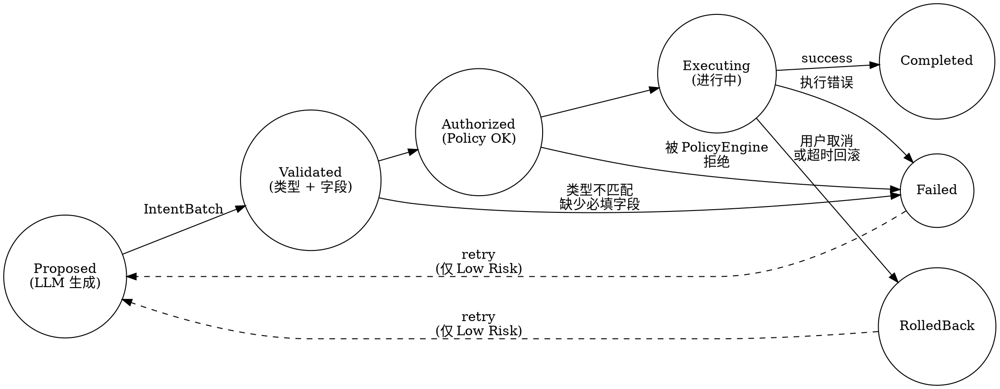

# 核心状态机

DiPECS 有两层状态机：**管道状态机**（daemon 的事件处理生命周期）和**动作状态机**（单个 Action 的执行生命周期）。两层正交但通过 ActionBus 耦合。

## 管道状态机

Daemon 主循环的状态转移：



### 状态详情

| 状态 | 进入条件 | 核心操作 | 异常处理 |
| :--- | :--- | :--- | :--- |
| **Idle** | 启动 / Recording 完成 | 等待事件循环 tick | — |
| **Collecting** | 100ms timer 触发 | adapter 扫描 /proc、Binder tracepoint | 采集源失效 → 降级到可用源 |
| **Sanitizing** | mpsc channel 收到 RawEvent | PrivacyAirGap.sanitize()，原始字符串 drop | 脱敏逻辑异常 → 丢弃该事件，记录 warn |
| **Aggregating** | SanitizedEvent 进入 buffer | WindowAggregator.push()，检测窗口到期 | buffer 溢出 → 强制 flush |
| **Inferring** | 窗口到期或手动 flush | CloudProxy.evaluate() → HTTP POST | 超时 → 降级到 MockCloudProxy；网络不可用 → 本地保守策略 |
| **Evaluating** | IntentBatch 到达 | PolicyEngine.evaluate_batch()，逐条校验 risk + confidence | 全部拒绝 → 仍写 trace，跳回 Idle |
| **Executing** | PolicyEngine 批准 | ActionExecutor.execute_batch()，按紧迫度排序 | 执行失败 → rollback，记录 ActionResult.failed |
| **Recording** | 所有 action 处理完毕 | TraceEngine.write(window_id, full_chain) | 写盘失败 → error! 日志，不阻塞管道 |

### 关键不变量

- **Privacy first**：Sanitizing 之后不存在任何含 PII 的数据结构
- **No skip**：Evaluating 状态不可跳过——即使所有 intent 都是 Low Risk，也必须经过 PolicyEngine
- **Idempotent trace**：同一 window_id 重复 Recording → trace 覆盖而非追加

---

## 动作状态机

单个 Action 从生成到完成的生命周期：



### 状态转移表

| 当前状态 | 事件 | 目标状态 | 副作用 |
| :--- | :--- | :--- | :--- |
| Proposed | `IntentBatch.received` | Validated | 无 |
| Validated | `struct_check_pass` | Authorized | 无 |
| Validated | `struct_check_fail` | Failed | 记录 validation_error |
| Authorized | `policy_approve` | Executing | 记录 policy_decision |
| Authorized | `policy_reject` | Failed | 记录 rejection_reason |
| Executing | `execute_success` | Completed | 记录 latency_us |
| Executing | `execute_error` | Failed | 记录 error + 触发 rollback |
| Executing | `cancel / timeout` | RolledBack | compensation action 入队 |
| Failed | `retry` (Low Risk only) | Proposed | 递增 retry_count |
| RolledBack | `retry` (Low Risk only) | Proposed | 递增 retry_count |

### 不可逆状态

`Completed`、`Failed`（retry_count ≥ max_retries）、`RolledBack`（compensation 完成）均为终态。超过最大重试次数的 Failed 进入 Dead Letter，仅做统计不做重放。

---

## 两层状态机的耦合

```text
Pipeline: ... → Inferring → Evaluating → Executing → ...
                                          │
                    ┌─────────────────────┘
                    │  每个 Intent 生成一批 Action
                    ▼
Action:    Proposed → Validated → Authorized → Executing → Completed
                                                    │
                                                    ▼ failure
                                               RolledBack
```

Pipeline 的 Evaluating 状态创建 Action 并推进到 Authorized。Pipeline 的 Executing 状态批量推进 Action 到终态。如果所有 Action 到达终态时无 Completed，Pipeline 记录该窗口为 `no_effective_action`。

## 相关文档

- [Daemon 架构设计](daemon-architecture.md) — 管道状态机的代码级实现
- [设计哲学](philosophy.md) — 意图生命周期的叙述版
- [架构概览](overview.md) — 数据流视角
