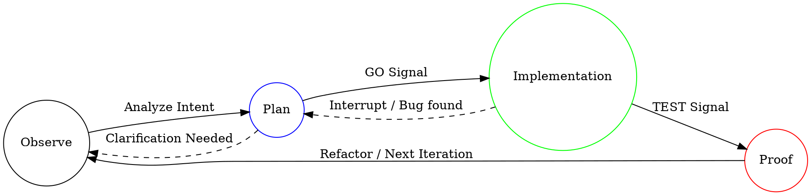

# 核心状态机 (Core State Machine)

本文档定义了 DiPECS 系统的核心状态转移逻辑。

## 状态转移图 (State Transition Diagram)

## 模块状态定义

### 1. Observe (观测)

逻辑层对物理环境的初步扫描。

### 2. Plan (规划)

确定性架构蓝图。

### 3. Implementation (实现)

直接物理文件修改。

### 4. Proof (验证)

终端真实测试反馈。
